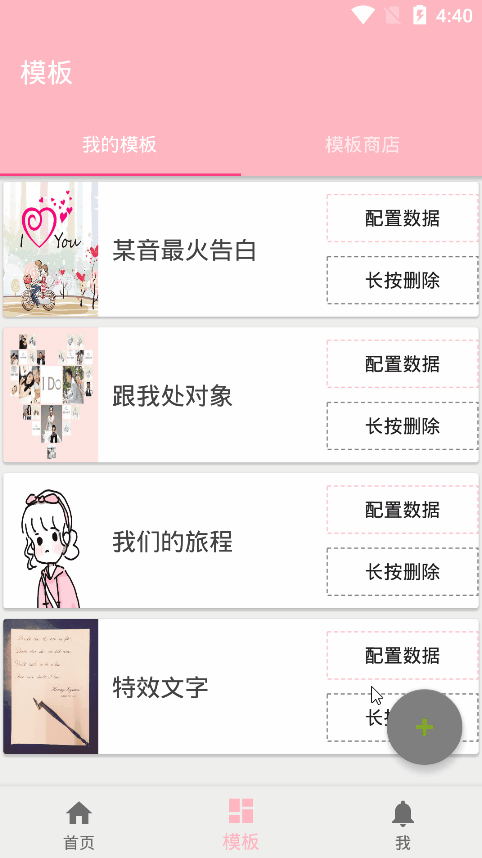
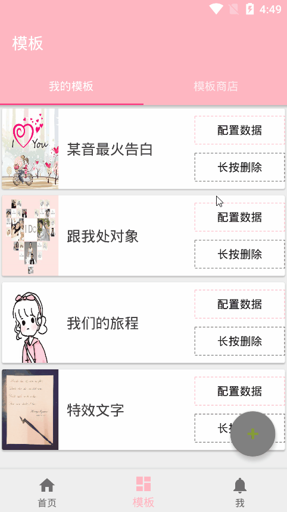
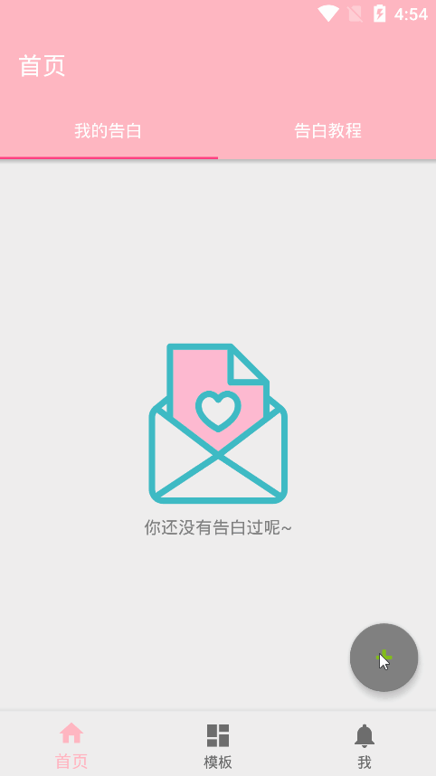
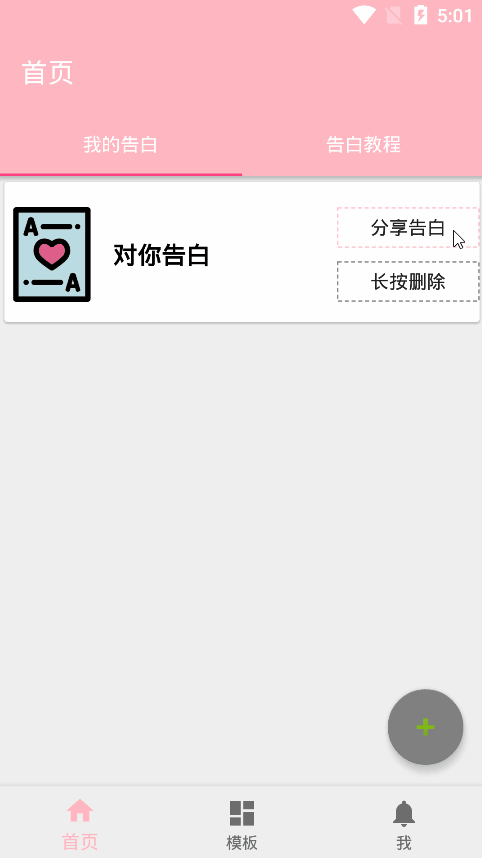

# confession-android

## 应用介绍

## 应用展示

    

        模板数据配置页面
        
         
    

    

        下载在线模板
         
		
    

    

    	 
		 
        生成告白
         
        
    

    

         
		 
        开始告白
         
		
    

## 技术架构

:white_check_mark: 安卓端基于 [**Kotlin** ](https://www.kotlincn.net/)与 java 混合开发

:white_check_mark: 底层使用 [**FreeMarker Java Template Engine**](https://freemarker.apache.org/) 模板引擎渲染页面

:white_check_mark: 基于[ **Okhttp3**  ](https://square.github.io/okhttp/4.x/okhttp/okhttp3/)封装网络请求

:white_check_mark: 使用 [**BaseRecyclerViewAdapterHelper**](https://github.com/CymChad/BaseRecyclerViewAdapterHelper) 作为RecycleView适配器

:white_check_mark: 基于 [**yanzhenjie/AndPermission**](https://github.com/yanzhenjie/AndPermission) 处理应用层权限请求处理

:white_check_mark: 使用 [**ZXing**](https://github.com/zxing/zxing) 处理应用端二维码生成

## 部署应用

安卓端 `confession-android` 部署

1. 克隆项目到本地电脑硬盘

~~~shell
git clone https://github.com/wjjer/confession-android.git
~~~

2. 修改必要配置文件

修改 vip.ablog.confession.global.Constant 文件

~~~shell
# 改为你的confession-server地址
public static final String SERVER_URL = "";
# 改为你的web页面服务器地址
public static final String SERVER_HOST = "";
~~~

3. 服务端部署 confession-server 部署

服务端部署参见服务端应用 [**confession-server部署教程**](https://github.com/wjjer/confession-server)

